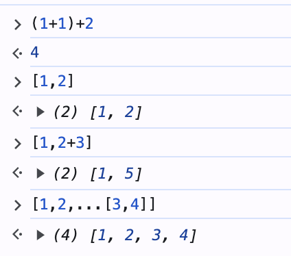

## 평가와 일급

- 평가 : 코드가 계산(Evaluation) 되어 값을 만드는 것



- 일급
  - 값으로 다룰 수 있다.
  - 변수에 담을 수 있다.
  - 함수의 인자로 사용될 수 있다.
  - 함수의 결과로 사용될 수 있다.

```javascript
const a = 10; //값으로 다룰 수 있고, 변수에 담을 수 있다.
const add10 = (a) => a + 10; //함수의 인자로 사용될 수 있다.
add10(a); //리턴값으로도 사용가능.
```

자바스크립트에서 함수는 일급에 포함되기에 위와 같은 특징을 모두 가진다.

이 때, 함수를 값으로 다루는 함수를 **고차 함수**라고 하는데, 아래와 같은 2가지 종류를 볼 수 있다.

- 함수를 인자로 받아서 실행하는 함수
- 함수를 만들어 리턴하는 함수(클로저를 만들어 리턴하는 함수)

```javascript
// (1) 함수를 인자로 받아서 실행하는 함수
const apply1 = (f) => f(1);
const add2 = (a) => a + 2;

console.log(apply1(add2));

// (2) 함수를 만들어 리턴하는 함수
const addMaker = (a) => (b) => a + b;
const add5 = addMaker(5);
// add5 = (5) => (b) => 5+b
// add5 = (b) => 5+b를 반환받고 2를 인자로 받으면 (2) => 5+2가 실행된다.

console.log(add5(2));
```

2번 예제에서는 실제로 5+b가 반환되는것이아니라 a+b가 반환되지만 클로저의 특징에 의해 a값이 기억되어 계산된다.

    클로저는 주변 상태(어휘적 환경)에 대한 참조와 함께 묶인(포함된) 함수의 조합입니다. 즉, 클로저는 내부 함수에서 외부 함수의 범위에 대한 접근을 제공합니다. JavaScript에서 클로저는 함수 생성 시 함수가 생성될 때마다 생성됩니다.

    클로저는 자신이 생성될 때의 환경을 기억하는 함수이다.

## 이터러블/이터레이터 프로토콜

- 이터러블: 리턴하는 [Symbol.iterator]() 를 가진 값
- 이터레이터: { value, done } 객체를 리턴하는 next() 를 가진 값
- 이터러블/이터레이터 프로토콜: 이터러블을 for...of, 전개 연산자 등과 함께 동작하도록한 규약

```javascript
const map = new Map([
  ["a", 1],
  ["b", 2],
  ["c", 3],
]);
// const set = new Set([1, 2, 3]);
// const arr = [1, 2, 3];
let iter2 = map[Symbol.iterator]();
console.log(iter2.next());
```

#### 사용자 정의 이터러블을 통해 알아보기

```javascript
const iterable = {
  [Symbol.iterator]() {
    let i = 3;
    return {
      next() {
        return i == 0 ? { done: true } : { value: i--, done: false };
      },
      // 자기 자신을 return 하도록
      // [Symbol.iterator]() {
      //   return this;
      // }
    };
  },
};
let iterator = iterable[Symbol.iterator]();
//   iterator.next();
//   iterator.next();
for (const a of iterator) log(a);

const arr2 = [1, 2, 3];
let iter2 = arr2[Symbol.iterator]();
iter2.next();
log(iter2[Symbol.iterator]() == iter2); // true => Symbol.iterator는 자기 자신을 return하기 때문
for (const a of iter2) log(a);
```

#### "Well-formed iterator"

이터레이터(iterator) 객체가 일반적으로 기대되는 동작을 제대로 수행하는 것을 말합니다.

- next() 메서드: 이터레이터 객체는 next() 메서드를 가지고 있어야 합니다. next() 메서드는 { value, done } 형태의 객체를 반환해야 합니다. value는 현재 값을 나타내며, done은 순회가 완료되었는지 여부를 나타냅니다.

- 반복 가능성: 이터레이터 객체는 자체적으로 이터러블(iterable)해야 합니다. 이는 이터레이터 객체의 [Symbol.iterator]() 메서드가 이터레이터 자신을 반환해야 함을 의미합니다. 이는 이터레이터 객체를 다시 이터레이션할 수 있는 순환 가능한 객체로 만들어줍니다.

- 순회 동작: 이터레이터 객체는 순회를 위한 반복 구문인 for...of 루프와 함께 사용될 수 있어야 합니다. 이는 이터레이터 객체가 이터러블 프로토콜을 준수하고 순차적으로 값을 반환할 수 있어야 함을 의미합니다.

```javascript
// 이터러블로 사용가능한 다른 예시
for (const a of document.querySelectorAll("*")) log(a);
const all = document.querySelectorAll("*");
let iter3 = all[Symbol.iterator]();
log(iter3.next());
log(iter3.next());
log(iter3.next());
```

## 제너레이터/이터레이터

- 제너레이터: 이터레이터이자 이터러블을 생성하는 함수 = 이터레이터를 반환하는 함수

> ⭐️ 제너레이터를 통해 어떤 값도 순회하게 만들 수 있다,
> 제너레이터는 순회하는 값을 문장으로 표현한다고 말할 수 있다

```javascript
function* gen() {
  /**
   * yield
   * - 값 반환: 제너레이터 함수의 실행을 일시 중지하고, 특정 값을 호출자에게 반환
   * - 상태 저장: 제너레이트 함수는 yield를 만날 때 까지 실행되며, 그 지점에서 일시 중지되어 상태를 저장
   *      그 이후 next() 메서드를 호출하면 저장된 상태부터 다시 실행
   * */
  yield 1;
  if (false) yield 2;
  yield 3;
}

let iter = gen();
console.log(iter[Symbol.iterator]() == iter); // true
console.log(iter.next());
```

순회하는 특징을 이용한 활용 예시

```javascript
// 기본적인 odd 제너레이터 (순회하는 값)
function* odds(l) {
  for (let i = 0; i < l; i++) {
    if (i % 2) yield i;
  }
}

// limit을 이용한 odd 제너레이터
function* infinity(i = 0) {
  while (true) yield i++;
}

function* odds(l) {
  for (const a of infinity(1)) {
    if (a % 2) yield a;
    if (a === l) return;
  }
}

// limit을 이용한 odd 제너레이터
function* odds(l) {
  for (const a of infinity(1)) {
    if (a % 2) yield a;
    if (a === l) return;
  }
}

/**
 * limit
 * - 제너레이터를 받아서 l까지만 순회하도록 제한
 * */
function* limit(l, iter) {
  for (const a of iter) {
    yield a;
    if (a === l) return;
  }
}

function* odds(l) {
  for (const a of limit(l, infinity(1))) {
    if (a % 2) yield a;
  }
}
```

전개 연산자, 구조 분해, 나머지 연산자 예시 → 전개연산자를 이용하면 이터러블 객체의 내부 값을 펼쳐서 확인할 수 있다.

```javascript
console.log(...odds(10));
```

#### 제너레이터를 활용해 map, reduce, filter 구현해보기

✔︎ map

```javascript
const map = (f, iter) => {
  let res = [];
  for (const a of iter) {
    res.push(f(a));
  }
  return res;
};

function* gen() {
  yield 2;
  if (false) yield 3;
  yield 4;
}

log(map((a) => a * a, gen()));
```

✔︎ reduce

```javascript
const reduce = (f, acc, iter) => {
  if (!iter) {
    iter = acc[Symbol.iterator]();
    // 1번째 값으로 초기화
    acc = iter.next().value;
  }
  // 누적값이 acc에 저장되고 있음
  for (const a of iter) {
    acc = f(acc, a);
  }
  return acc;
};

const add = (a, b) => a + b;

// log(reduce(add, 0, [1, 2, 3, 4, 5]));
// // 15

// log(add(add(add(add(add(0, 1), 2), 3), 4), 5));
// // 15

log(reduce(add, [1, 2, 3, 4, 5]));
/*
  f는 add 함수입니다.
acc는 [1, 2, 3, 4, 5] 배열입니다.
iter는 전달되지 않았으므로 undefined입니다.
  */
```

✔︎ filter

```javascript
const filter = (f, iter) => {
  let res = [];
  for (const a of iter) {
    if (f(a)) res.push(a);
  }
  return res;
};

log(...filter((p) => p.price < 20000, products));

log(...filter((p) => p.price >= 20000, products));
```

✔︎ 위 함수 중첩 사용 예시
함수형 프로그래밍에서는 함수들을 중첩하고 함수들을 연속적으로 실행하면서 평가를 만들어서 원하는 마지막 일을 처리하는 방식으로 생각할 수 있다.

```javascript
const products = [
  { name: "반팔티", price: 15000 },
  { name: "긴팔티", price: 20000 },
  { name: "핸드폰케이스", price: 15000 },
  { name: "후드티", price: 30000 },
  { name: "바지", price: 25000 },
];

const add = (a, b) => a + b;

// price가 20000 미만인 상품들의 가격 총합
log(
  reduce(
    add,
    map(
      (p) => p.price,
      filter((p) => p.price < 20000, products)
    )
  )
);

// price가 20000 이상인 상품들의 가격 총합
log(
  reduce(
    add,
    filter(
      (n) => n >= 20000,
      map((p) => p.price, products)
    )
  )
);
```
