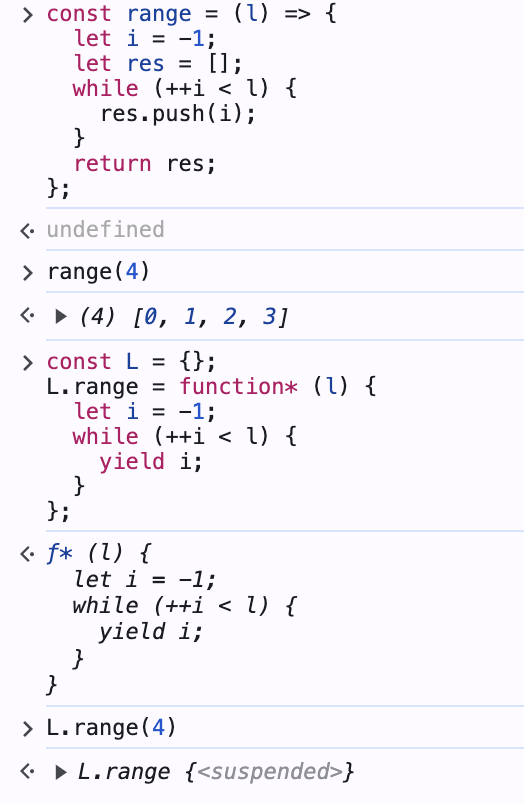

### 이터러블 중심의 프로그래밍에서의 지연 평가 (Lazy Evaluation)

- 지연 평가는 게으른 평가라고 하지만 영리한 평가, 제때 계산법, 느긋한 계산법이라고도 한다.
- 가장 필요할 때 까지 그 평가를 미루다가 가장 필요할 때 해당 코드들을 평가하면서 값을 만들어서 사용한다.
- 기존 자바스크립트에서는 지원하지 않는 기능이었지만, ES6로 넘어가면서 제너레이터와 이터러블을 사용할 수 있게 되면서 라이브러리나 서로 다른 함수들을 안전하게 조합하고 합성하여 프로그래밍을 할 수 있게 되었다.

### Lange라는 배열을 반환함수를 두가지 코드로 비교해보자.

```javascript
// range
const range = (l) => {
  let i = -1;
  let res = [];
  while (++i < l) {
    res.push(i);
  }
  return res;
};

var list = range(4); // 즉시 배열로 평가가 된다.
log(list);
log(reduce(add, list));

// L.range
const L = {};
L.range = function* (l) {
  let i = -1;
  while (++i < l) {
    yield i;
  }
};
```



위와 같이 배열은 range함수는 즉시 배열로 평가가되지만 L.range함수는 배열 형태가 아닌 채로 함수가 입력되었다 필요 시 평가가 이루어져 값을 꺼내어 작동한다.

### 연산 시간 비교해보기.

```Javascript

function test(name, time, f) {
  console.time(name);
  while (time--) f();
  console.timeEnd(name);
}
test('range', 10, () => reduce(add, range(1000000)));
// 4893...
test('L.range', 10, () => reduce(add, L.range(1000000)));
// 295...
```

### take 함수로 비교해보기.

```javascript
// 많은 값을 받아서 잘라주는 함수

const take = curry((l, iter) => {
  let res = [];
  for (const a of iter) {
    res.push(a);
    if (res.length == l) return res;
  }
  return res;
});

// 이터러블을 받기 때문에 만든 range함수를 쓸 수 있다 → 전혀 다른 함수가 이터러블 프로토콜을 따르면 소통이 가능하기때문에 조합성이 높다.
take(5, range(Infinity));
take(5, L.range(Infinity));
// 결과로 range와 다르게 5개만 뽑아 사용되기 때문에 지연성이 가지고 있는 효율을 확인할 수 있다.
```
